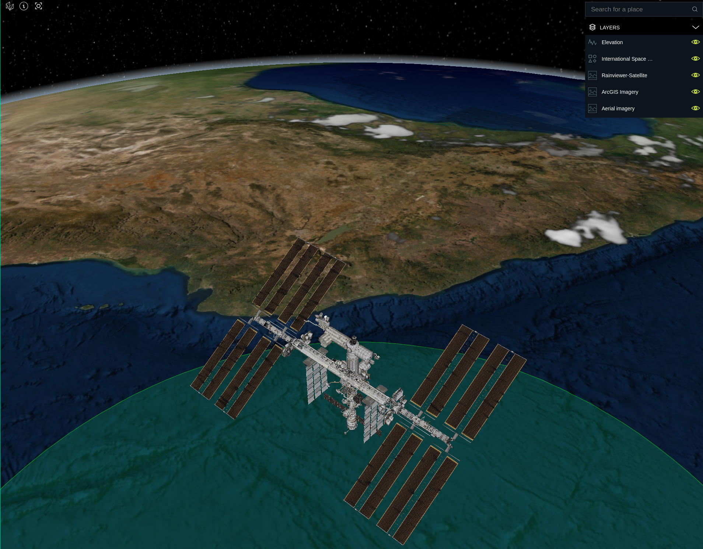

# 🌎 Geospatial technologies workshop  

A sample application to show how to interact with geospatial data sources using LuciadRIA.

## 🚀 Getting started

### Requirements

- Latest LTS version of [Node](https://nodejs.org/en/download/).
- LuciadRIA distrubution 2021.x.x

### Instalation

1. (Optional) Update all `webpack-cli` dependencies of projects inside `samples/` directory to `4.10.0`.
1. Run `npm install` at root directory.
1. Clone this repository on `samples/` directory.

### Running Locally

1.  `npm run dev` to start the development server.
1.  open `http://localhost:3001/?webgl=true&reference=EPSG:4978` in your browser.
